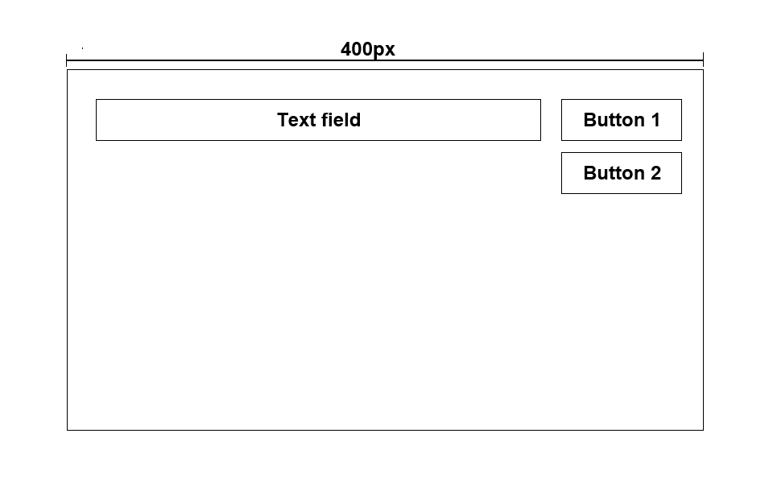

## Please complete the following tasks as much as you can.

-   Do the following three tasks as much as you can.
-   You should prepare a repository for these tasks, with one folder for each task.
-   Please send back the GitHub URL. Good luck!

### Task 1: Coding assignment 1

You can accomplish this task using any JavaScript framework you like, or even with pure JavaScript.



-   Outer frame: Width 400px, no height limit, with border "1px solid red".
-   Inner element: 2 buttons, 1 text field, you can arrange them as you like.
    -   Text field: Non-editable as normal, just like `<p></p>` or any block element, and can be edited after clicking button 1.
    -   Button 1: With the text "edit", when the user clicks it, text field will toggle between non-editable and editable modes.
    -   Button 2: With the text "resize", when the user clicks it, outer frame will toggle between 400px and 800px.

Expect: The buttons' size should be fixed, and the text field should automatically resize when the outer frame or inner text changes.

### Task 2: Coding assignment 2

You can accomplish this task using any JavaScript framework you like, or even with pure JavaScript.

-   Now we have two buttons:
    -   Button 1: With the text "start".
    -   Button 2: With the text "end".

Expect: Click button 1 first, wait a few seconds, and then click button 2. The browser should display the time duration between these two click.

### Task 3: Understanding

Please answer the following three questions in .txt file based on the javascript code below.

1. Simply describe what "function1" will do.
2. Can we stop what "function1" is doing? How?
3. How to optimize this snippet?

```js
import { call, put } from "redux-saga/effects";

let ctrl;

function* function1(action) {
    ctrl = new AbortController();
    const config = {
        method: "POST",
        url: "https://some-endpoint-url.com",
        data: action.payload,
        signal: ctrl.signal,
    };

    try {
        const { data } = yield call(/** a axios request with config */);

        yield put(/** reducer 1 */);
    } catch (e) {
        if (e.response) {
            const er = e.response;

            yield put(/** reducer 2 */);

            return;
        }
    } finally {
        if (ctrl.signal.aborted) {
            yield put(/** reducer 3 */);
        }
    }
}

function function2() {
    ctrl.abort();
}
```
